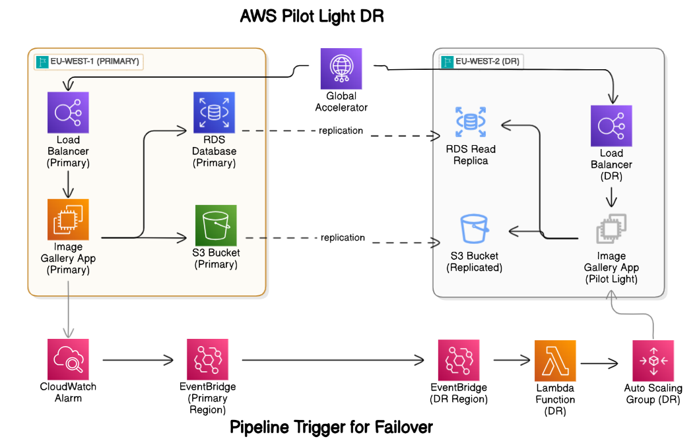
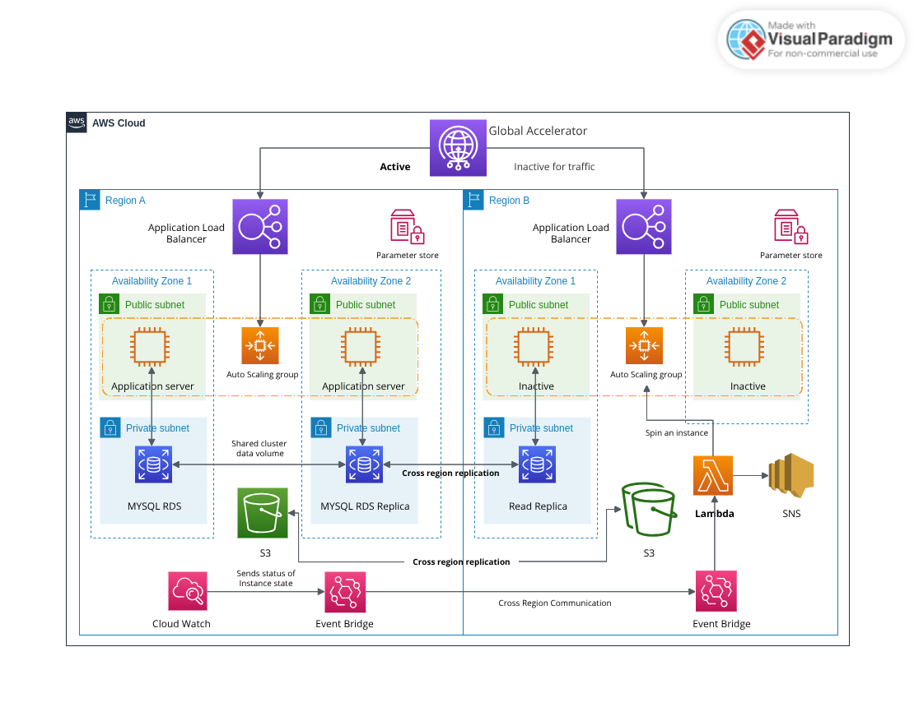

# Disaster Recovery Project - Pilot Light Strategy

This project implements a disaster recovery (DR) solution using the Pilot Light strategy with Terraform. The infrastructure is organized in a modular and manageable way to ensure easy maintenance and scalability.


<p align="center">  </p>

## Project Structure

The architecture consists of the following components:

### Primary Region (eu-west-1)

- VPC with public and private subnets
- Auto Scaling Group for EC2 instances
- RDS MySQL database
- S3 bucket for image storage
- Application Load Balancer
- AMI Builder instance for creating and copying AMIs to DR region

### DR Region (us-east-1)

- VPC with public and private subnets
- Auto Scaling Group for EC2 instances (initially scaled to 0)
- RDS MySQL read replica
- Access to S3 bucket replicated from primary region
- Application Load Balancer
- Lambda function for handling failover

### Global Components

- Global Accelerator for automatic traffic routing between regions
- EventBridge for cross-region event routing
- IAM roles and policies for cross-region operations
- Security groups for EC2, RDS, and Lambda resources

## Disaster Recovery Strategy

This project implements a "Pilot Light" disaster recovery strategy with the following characteristics:

1. **Primary Region (eu-west-1)**: Runs the full application stack with active resources.
2. **DR Region (us-east-1)**: Maintains minimal resources (RDS read replica, ASG scaled to 0) until failover is triggered.
3. **Automated Failover**: When primary region failure is detected, EventBridge triggers Lambda in the DR region to scale up the ASG.
4. **Global Accelerator**: Provides static IP addresses and automatically routes traffic to the healthy region based on health checks.
5. **Data Replication**: S3 bucket replication and RDS read replica ensure data consistency across regions.

## Setup Instructions

### Prerequisites

- AWS CLI installed and configured with appropriate credentials
- Terraform v1.0.0 or later
- Git (to clone this repository)

### Deployment Steps

1. **Clone the repository**

   ```bash
   git clone <repository-url>
   cd disaster_recovery_project
   ```

2. **Create terraform.tfvars files**

   Create `environments/primary/terraform.tfvars` with the following variables:

   ```hcl
   # AWS Credentials
   aws_access_key = "YOUR_ACCESS_KEY"
   aws_secret_key = "YOUR_SECRET_KEY"

   ```

   **Important**: Update the SNS notification email in `environments/dr/main.tf` (line ~211) to your email address

3. **Deploy Primary Environment**

   ```bash
   cd environments/primary
   terraform init
   terraform plan
   terraform apply
   ```

4. **Deploy DR Environment**

   ```bash
   cd ../dr
   terraform init
   terraform plan
   terraform apply
   ```

   > **Note**: You will receive an email to confirm the SNS subscription. Click the confirmation link to receive failover notifications.

5. **Deploy Global Environment**
   ```bash
   cd ../global
   terraform init
   terraform plan
   terraform apply
   ```

## Testing Disaster Recovery

### Simulating a Disaster

A failover simulation script is provided to test the disaster recovery process:

```bash
cd environments/primary
chmod +x simulate_failover.sh
./simulate_failover.sh
```

This script will:

1. Terminate the AMI builder instance in the primary region
2. Delete the RDS instance without creating a final snapshot
3. Wait for EventBridge to detect these changes

### What Happens During Failover

1. EventBridge in the primary region detects the RDS instance deletion
2. The event is forwarded to EventBridge in the DR region
3. Lambda function in the DR region is triggered
4. Lambda scales up the ASG in the DR region
5. The RDS read replica is promoted to a standalone instance
6. Global Accelerator detects that the primary region's load balancer is unhealthy
7. Traffic is automatically routed to the DR region's load balancer
8. You will receive an SNS notification about the failover

### Monitoring the Failover

- Check the CloudWatch Logs for the Lambda function in the DR region
- Monitor the ASG in the DR region to see instances being launched
- Observe the Global Accelerator endpoint to verify traffic routing

## Architecture Diagram

<p align="center">  </p>

## Customization

You can customize the following aspects of the project:

- **Instance Types**: Modify `instance_type` in the terraform.tfvars files
- **Database Configuration**: Update DB parameters in terraform.tfvars
- **Auto Scaling**: Adjust min/max/desired capacity in the EC2 module
- **Regions**: Change primary and DR regions in the terraform.tfvars files

## Limitations and Considerations

- The failover process takes approximately 3-5 minutes to complete
- During failover, there will be a brief period of downtime
- Database transactions that occurred immediately before the disaster may be lost
- The solution assumes that the DR region itself is not experiencing issues
- Cost optimization: The DR environment is designed to minimize costs during normal operation

## Cleanup

To avoid incurring charges, destroy the resources when they are no longer needed:

```bash
cd environments/global
terraform destroy

cd ../dr
terraform destroy

cd ../primary
terraform destroy
```
